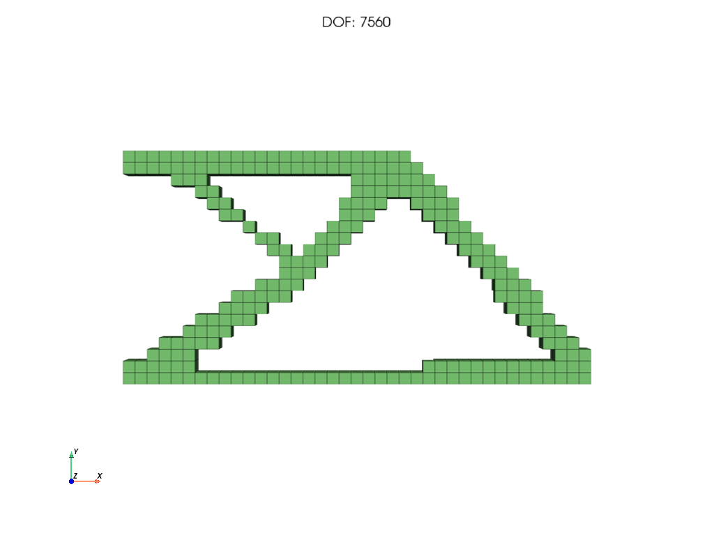

# PyTO: Python Topology Optimization

PyTO is a Python library, with a desktop GUI, for **3D topology optimization** of parts on voxel (hexahedral) meshes. You bring an STL of the design space, apply supports and loads, and PyTO finds where material should go to minimize, or maximize, an objective under constraints. Gradients come from **automatic differentiation** (PyTorch autograd through the FE solve), so new objectives and constraints need no hand-derived sensitivities.



**📖 Documentation: [docs/](docs/README.md)**: code and GUI guides, post-processing, extending PyTO, theory and reference.

## Capabilities
- **Physics:** linear elasticity, steady heat conduction, and one-way coupled thermo-structural analysis, on voxel meshes made automatically from STL files.
- **Methods:** MMA (any objective and constraints), OC, Pareto (topological sensitivity) and level set.
- **Formulations:**
  - compliance, volume, mass, displacement, temperature, reaction force, p-norm stress and failure factor;
  - **your own formulas** (e.g. `Displacement(Tip, y, mean) / 1e-3 + 0.1 * VolumeFraction()`) or **Python functions**, differentiated automatically;
  - optional **manual gradients** for compliance, p-norm stress and volume fraction.
- **Manufacturing:** density filter, Heaviside projection, symmetry, cyclic symmetry, extrusion, keep-solid regions.
- **Results:** stress, deformation and temperature views, VTU export, and smooth STL recovery of the optimized part.
- **Validation:**
  - 46 benchmark problems;
  - published thermo-structural results reproduced;
  - gradients checked against finite differences;
  - about 230 automated tests.

Not available yet: transient thermal, modal, tetrahedral FE and large-deformation analysis.

## Installation
Python 3.10 in a conda environment named `PyToLib`:
```bash
git clone https://github.com/UW-ERSL/PyTO
cd PyTO
conda create -n PyToLib python=3.10
conda activate PyToLib
pip install -r requirements.txt        # requirements-dev.txt adds the test tools
```
Details (CPU-only PyTorch, macOS, optional packages): [Installation](docs/getting-started/installation.md).

## Quick start: code
```python
import pyto.autodiff.sparse_solve as sparse_solve
from pyto.examples_benchmarks.topopt_structural_benchmarks import StructuralTOExamples, getStructuralTOProblem
from pyto.physics.structural.hex_structural_fea import HexStructuralFEA
from pyto.topopt.common import TO_QOI
from pyto.topopt.drivers.mma import topopt_mma

mesh, material, bc, body_force, to_params = getStructuralTOProblem(StructuralTOExamples.CantileverTipLoad,
                                                                   nDOFDesired=5000)
fe = HexStructuralFEA(mesh=mesh, mat_prop=material, bc=bc, solver=sparse_solve.Solvers.SPSOLVE)
to_params.Objective = (TO_QOI.COMPLIANCE, None)
to_params.Constraints = [(TO_QOI.VOLUME_FRACTION, None, 0.3)]
u, history, success, message, n_fea = topopt_mma(fe, to_params=to_params, maxMMAIterations=30)
```
Run with `PYTHONPATH=src`, or run the complete version: `python docs/examples/quickstart.py`. Next: [Quick start: code](docs/getting-started/quickstart-code.md), [A problem from scratch](docs/code/problem-from-scratch.md).

## Quick start: GUI
```bash
python run_gui.py
```
It restarts itself in the `PyToLib` environment if needed. Then work down the sidebar: Geometry → Material → Loads → Analysis → TopOpt Execute. See [Quick start: GUI](docs/getting-started/quickstart-gui.md).

To explore the benchmark problems, open `main.ipynb`: [Quick start: notebook](docs/getting-started/quickstart-notebook.md).

## Where to go next
| I want to ... | Read |
|---|---|
| set up my own problem in Python | [A problem from scratch](docs/code/problem-from-scratch.md) |
| optimize a custom quantity | [Expressions](docs/code/expressions.md), [User-defined functions](docs/code/user-defined-functions.md) |
| use the GUI | [GUI overview](docs/gui/overview.md) |
| plot and export results | [Post-processing](docs/postprocessing/history-and-convergence.md) |
| add physics, filters, methods or ML | [Extending PyTO](docs/extending/architecture.md) |
| run the benchmarks or the tests | [Benchmarks from code](docs/code/benchmarks-from-code.md), [Testing](docs/reference/testing.md) |

## Repository layout
| Path | Contents |
|---|---|
| `src/pyto/` | the library ([architecture](docs/extending/architecture.md)) |
| `docs/` | documentation and runnable examples |
| `run_gui.py` | GUI launcher |
| `main.ipynb` | benchmark notebook |
| `Models/` | example STL files and projects |
| `tests/` | automated tests |

## Contributing
Open an issue or a pull request. Please run the test suite before submitting ([Testing](docs/reference/testing.md)); new features come with tests ([Testing your extension](docs/extending/testing-your-extension.md)). By contributing, you agree that your contribution is licensed under GPL-3.0, like the rest of PyTO.

## License
Copyright (c) 2025-2026 UW-ERSL (Engineering Representations and Simulation Laboratory), University of Wisconsin-Madison.

PyTO is open-source software, licensed under the **[GNU General Public License v3.0](LICENSE)** (GPL-3.0):
- **You may** use, study, change and share PyTO for any purpose, including research, teaching and commercial work.
- **If you distribute** PyTO, or a program built on it, you must release its source code under GPL-3.0 as well, and keep the copyright and licence notices. Nobody can turn PyTO into closed-source software.
- **No warranty:** PyTO comes as is; see sections 15–16 of the licence.

The GUI uses PyQt5, which is itself GPL-3.0.

If you use PyTO in academic work, please cite the repository.
