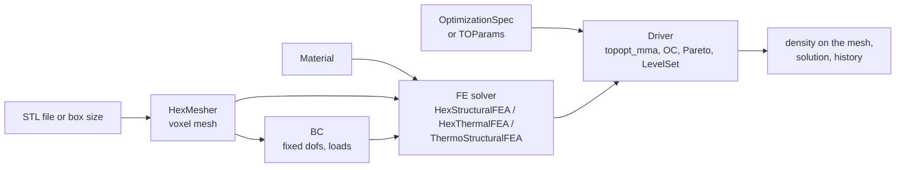

# Concepts

This page introduces the objects you work with in PyTO and how they fit together. Read it once before writing your own scripts; the other code pages assume these names.

## The pieces

| Object | Module | What it is |
|---|---|---|
| **Mesh** `HexMesher` | `pyto.core.hex_mesher` | A voxel mesh: identical box elements (8 nodes each) filling the part. Made from an STL (`createMeshFromSTLFile`) or a box (`grid_mesh`). Holds node coordinates `node_xyz`, element connectivity `elemArray`, element centres `elem_centers`, the element size `elem_size`, and the current design `elemPseudoDensity`. |
| **Material** `Material` | `pyto.core.mat_lib` | Young's modulus, Poisson's ratio, density, conductivity, expansion coefficient, yield strength. `get_material("Steel")`, or `create_material_with_defaults(name, **overrides)`. |
| **Boundary conditions** `BC` | `pyto.core.bc` | `force` (one entry per dof), `fixed_dofs` and their `dirichlet_values`. Structural problems have 3 dofs per node (`3*i`, `3*i+1`, `3*i+2` for x, y, z); thermal problems have 1 (the temperature). |
| **FE solver** | `pyto.physics.*` | Assembles and solves the physics on the mesh. `fe.solve(x)` takes a density per element and returns the solution: displacements (structural), temperatures (thermal) or displacements with the temperature kept on `fe.temperature` (thermo-structural). |
| **Density** `x` | torch tensor, one value per element | The design: 1 = solid, 0 = void, in between = grey (penalized so it's not worth using). The optimizers work on `x`. |
| **Response** | `pyto.autodiff.qoi.responses` | A quantity computed from the solution and the density: compliance, displacement at a selection, stress, temperature, mass, ... Objectives and constraints are built from responses. |
| **Formulation** | `pyto.topopt.spec` / `pyto.topopt.common` | What to optimize. Either written as data (`OptimizationSpec` with expressions, compiled by `compile_spec`) or set directly on `TOParams` (`Objective`, `Constraints`). |
| **Settings** `TOParams` | `pyto.topopt.common` | Everything the drivers read: objective, constraints, filter radius, symmetry, extrusion, Heaviside projection, iterations, gradient mode, ... |
| **Driver** | `pyto.topopt.drivers` | The optimization method: `topopt_mma` (MMA), `topopt_optimality_criteria` (OC), `topopt_pareto`, `topopt_levelset`. |

## How one optimization step works
For the density methods (MMA, OC), each iteration does:
1. **Filter** the design: `x_phys = H x / Hs`. It averages each element with its neighbours within the filter radius, which prevents checkerboards and sets a minimum member size. Symmetry, extrusion and cyclic symmetry are extra filters applied the same way.
2. **Project** (optional): a smooth Heaviside step pushes grey values toward 0 or 1.
3. **Solve** the physics with the stiffness scaled per element by the material law (SIMP: $E(x) = E_{min} + x^p (E - E_{min})$).
4. **Evaluate** the objective and constraints from the solution.
5. **Differentiate** them with respect to the design:
   - by default with PyTorch autograd, backwards through the steps above, including the linear solve (an adjoint solve);
   - or with the [manual gradients](gradients.md) where available.
6. **Update** the design (MMA or OC step), within a move limit.

Because the gradient comes from autograd, any objective you can write with torch operations can be optimized, with no hand-derived sensitivity. See [Expressions](expressions.md) and [User-defined functions](user-defined-functions.md).

## Differentiable solve
`fe.solve(x, material_model)` returns a torch tensor that is connected to `x`: gradients flow through it. The linear system is solved by `pyto.autodiff.sparse_solve.solve`, a custom autograd function. Its backward pass solves the adjoint system with the same (already factorized, for PARDISO) matrix. That's why a gradient costs about one extra linear solve per quantity that depends on the solution.

## Units
PyTO works in **SI units** throughout: m, N, Pa, K, J, kg. STL files are read as metres. The GUI converts to and from display units, but bounds in formulations are always SI.

## Where the result is
After a driver returns:
- **Design:** `fe.mesh.elemPseudoDensity`, a numpy array with one value per element.
- **Solution of the final design:** the first return value (`u`), also kept on the solver (e.g. `fe.sol` for thermal problems).
- **Progress:** the `history` dict: `objective`, `volfrac`, `constraint_1`, ...; see [History and convergence](../postprocessing/history-and-convergence.md).

---
Next: [A problem from scratch](problem-from-scratch.md) · [Back to contents](../README.md)
