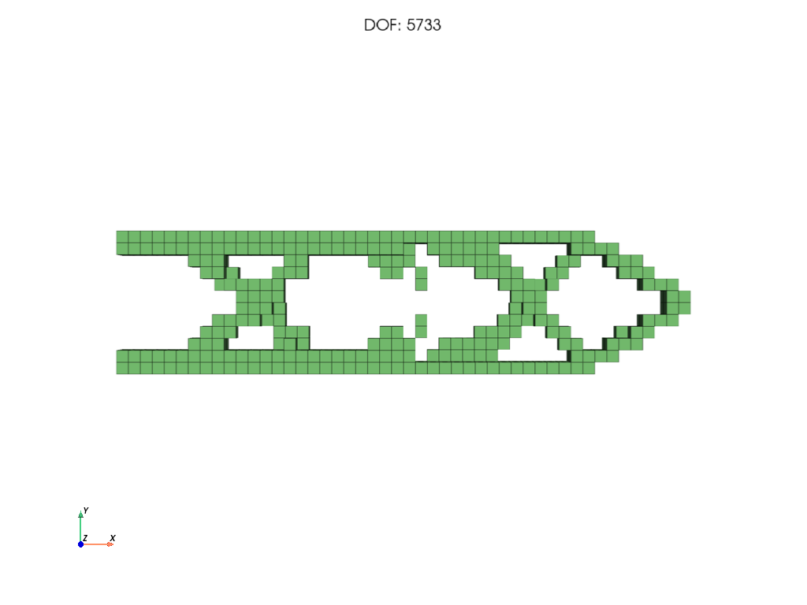

# A problem from scratch

This page builds a complete topology optimization problem in code, with no benchmark helpers: mesh, material, supports, loads, FE solver, formulation, optimization. Use it as the template for your own problems.

The full script is [`docs/examples/problem_from_scratch.py`](../examples/problem_from_scratch.py). It optimizes a clamped 2 m beam for minimum tip deflection with at most 40 % material:



## 1. Mesh
Two ways to get a voxel mesh:

**A box** of given size and element counts:
```python
from pyto.core.hex_mesher import HexMesher

L = (2.0, 0.5, 0.1)                 # size in m
n = (48, 12, 2)                     # elements per direction
mesh = HexMesher()
mesh.grid_mesh(num_elems=n, elem_size=tuple(L[i] / n[i] for i in range(3)))
mesh.createEdofMatStructural()      # element -> dof table; use createEdofMatThermal() for thermal problems
```

**An STL file**, voxelized to about `nElemsDesired` elements:
```python
mesh = HexMesher()
mesh.createMeshFromSTLFile("Models/Cantilever/Cantilever.STL", nElemsDesired=3000)
mesh.createEdofMatStructural()
```
- STL coordinates are read as **metres**.
- Multi-body STLs are meshed as one domain with a component id per element.
- The element size is chosen automatically: `mesh.elem_size`.
- A rule of thumb: a structural problem has about `3 * nElemsDesired` unknowns.

Useful mesh data:

| Attribute | Meaning |
|---|---|
| `mesh.node_xyz` | (nodes, 3) coordinates |
| `mesh.elemArray` | (elements, 8) node numbers per element |
| `mesh.elem_centers` | (elements, 3) element centres |
| `mesh.num_nodes`, `mesh.num_elems`, `mesh.elem_size` | sizes |
| `mesh.elemPseudoDensity` | current design, one value per element |

## 2. Material
```python
import pyto.core.mat_lib as mat_lib

steel = mat_lib.get_material("Steel")          # also "Titanium", "Nitronic60", "Concrete"
alloy = mat_lib.create_material_with_defaults("MyAlloy", youngs_modulus=70e9, poissons_ratio=0.33,
                                              mass_density=2700, yield_strength=250e6)
```
`create_material_with_defaults` fills every property you don't give with the steel value. Stress constraints need `yield_strength`, self-weight needs `mass_density`, and thermal problems need `thermal_conductivity` (and `thermal_expansion_coefficient` for coupled problems).

## 3. Supports and loads
Boundary conditions are plain arrays over **dofs**. Structural node `i` has dofs `3*i` (x), `3*i+1` (y), `3*i+2` (z).
```python
import numpy as np
import pyto.core.bc as bound_cond

xyz = mesh.node_xyz
clamped = mesh.getNodesOnBoundingBoxPlane(0, True)          # all nodes on the x = min face
fixed_dofs = np.concatenate([3 * clamped, 3 * clamped + 1, 3 * clamped + 2])

tip = np.where(np.isclose(xyz[:, 0], L[0]) & (np.abs(xyz[:, 1] - L[1] / 2) < 0.03))[0]
force = np.zeros(3 * mesh.num_nodes)
force[3 * tip + 1] = -1000.0 / len(tip)                     # 1 kN in -y, shared by the tip nodes

bc = bound_cond.BC(force=force, fixed_dofs=fixed_dofs, dirichlet_values=np.zeros(len(fixed_dofs)))
```
- `force` holds **nodal forces in N**. To apply a total load, divide it over the nodes, as above.
- `dirichlet_values` are the prescribed displacements (usually 0). Non-zero values prescribe a displacement.
- The solver refuses supports that leave the part free to move or rotate in the direction of the load: *"BC is under-constrained ..."*.
- More ways to find nodes (faces of STL parts, coordinates, radii): [Selecting nodes and faces](selecting-nodes-and-faces.md).
- Optional: mark nodes for plots with `mesh.node_indices[nodes, 3] = 1` (support) or `2` (load). `fe.plot_mesh(plot_bc=True)` draws them.

**Self-weight and other body forces** are given per element when the solver is created. The value is the force on a *solid* element, in N; PyTO scales it with the density:
```python
elem_body_force = np.zeros(3 * mesh.num_elems)
elem_body_force[1::3] = -9.81 * steel.mass_density * np.prod(mesh.elem_size)     # gravity in -y
```

## 4. FE solver
```python
import pyto.autodiff.sparse_solve as sparse_solve
from pyto.physics.structural.hex_structural_fea import HexStructuralFEA

fe = HexStructuralFEA(mesh=mesh, mat_prop=steel, bc=bc, solver=sparse_solve.Solvers.PARDISO,
                      elem_body_force=None)         # or elem_body_force from above
u = fe.solve()                                      # analysis of the full (solid) design
```
- Use `Solvers.SPSOLVE` where PARDISO isn't installed (macOS).
- Thermal and coupled solvers: [Thermal and thermo-structural problems](thermal-and-thermostructural.md).

## 5. Formulation
The objective and constraints can be written as **expressions**, in the same language the GUI uses:
```python
from pyto.topopt.spec import ConstraintSpec, MethodSpec, ObjectiveSpec, OptimizationSpec, compile_spec, validate

selections = {"Tip": {"nodes": tip}}                  # names usable inside expressions
spec = OptimizationSpec(
    objective=ObjectiveSpec("Displacement(Tip, magnitude, pnorm) / 1e-4", "minimize"),
    constraints=[ConstraintSpec("VolumeFraction()", "<=", 0.4)],
    method=MethodSpec("MMA", max_iterations=40))
for issue in validate(spec, "structural", selections):
    print(issue)
to_params = compile_spec(spec, selections)
```
Or set the built-in types directly:
```python
from pyto.topopt.common import TOParams, TO_QOI

to_params = TOParams()
to_params.Objective = (TO_QOI.COMPLIANCE, None)
to_params.Constraints = [(TO_QOI.VOLUME_FRACTION, None, 0.4)]
```
Details: [Formulations with specs](formulation-with-spec.md), [Expressions](expressions.md), [User-defined functions](user-defined-functions.md).

## 6. Optimize and inspect
```python
from pyto.topopt.drivers.mma import topopt_mma

u, history, success, message, n_fea = topopt_mma(fe, to_params=to_params, maxMMAIterations=40,
                                                 print_progress=False)
print(history["objective"][-1], history["volfrac"][-1])
fe.plot_mesh(save_path="design.png", plot_bc=None, title=None, camera_position="xy")
```
- The optimized density is in `mesh.elemPseudoDensity`.
- More on the optimizer options: [Running the optimizers](running-optimizers.md).
- Plots and export: [Part 3](../postprocessing/fields-and-plots.md).

## Checklist for your own problem
- [ ] Mesh fine enough: at least 3–4 elements across the thinnest member you expect.
- [ ] Supports stop all rigid-body motion in the direction of the loads.
- [ ] Loads in N and spread over several nodes (a point load on one node gives a stress singularity).
- [ ] The volume or mass limit leaves enough material to carry the load.
- [ ] `validate()` reports no errors.
- [ ] Start with a coarse mesh and few iterations; refine once the setup is right.

---
Next: [Selecting nodes and faces](selecting-nodes-and-faces.md) · [Back to contents](../README.md)
