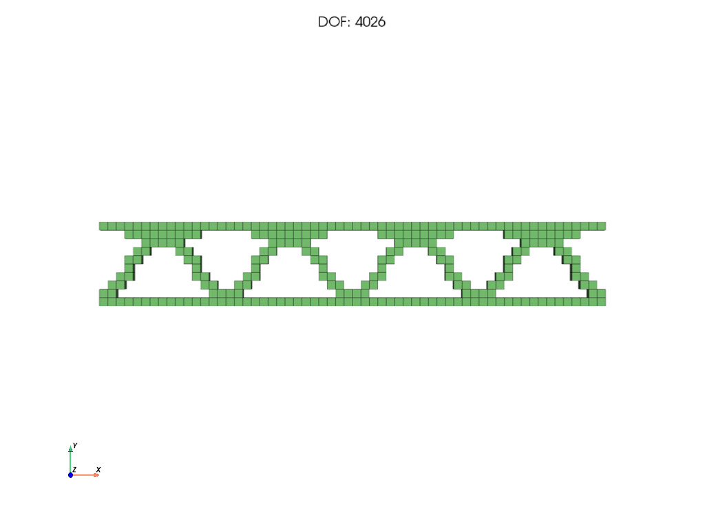

# Add a filter

This recipe adds a new filter to the design chain: a smoothing rule, a symmetry or pattern, a manufacturing restriction, or a nonlinear projection. It is for developers adding design-space rules.

## How filters work in PyTO
Linear filters are **sparse matrices** acting on the element densities. `createFilters(fe_solver, to_params)` in `topopt/common.py` builds the density filter and multiplies the enabled manufacturing filters into it:

$$\mathbf{H} = \mathbf{H}_{smooth}\,\mathbf{H}_{sym,x}\,\mathbf{H}_{sym,y}\cdots\mathbf{H}_{extrude}, \qquad x^{phys}_i = \frac{(\mathbf{H}\mathbf{x})_i}{\sum_j H_{ij}}$$

So each filter is applied to the design before the smoothing.

How each method uses `H`:

| Method | Use of `H` | Gradient through the filter |
|---|---|---|
| MMA | **density filter**: `x_phys = H x / Hs` | autograd (or the manual chain rule `Hᵀ(g / Hs)`), automatic |
| OC | **sensitivity filter** on `x · dC/dx` | inside the OC update |
| Pareto, LevelSet | smoothing of their sensitivities | inside the method |

A new linear filter therefore needs **no gradient code** for any method.

## Step 1: build the matrix
Add a function to `topopt/filters.py` that returns an `(num_elems, num_elems)` sparse matrix, with rows that sum to 1. The example: a design that **repeats `n` times along x** (periodic cells), made by averaging each element with its copies in the other cells.
```python
import numpy as np
from scipy.sparse import coo_matrix

def createXPeriodicFilter(mesh, n_cells: int):
    """Average every element with its copies in the other n_cells - 1 cells along x."""
    x0, x1 = mesh.bbox.x.min, mesh.bbox.x.max
    period = (x1 - x0) / n_cells
    rows, cols, data = [], [], []
    for i, c in enumerate(mesh.elem_centers):
        k0 = int((c[0] - x0) // period)
        copies = [j for k in range(n_cells)
                  if (j := mesh.get_element_near_point(np.array([c[0] + (k - k0) * period, c[1], c[2]]))) != -1]
        for j in copies:
            rows.append(i)
            cols.append(j)
            data.append(1.0 / len(copies))
    return coo_matrix((data, (rows, cols)), shape=(mesh.num_elems, mesh.num_elems)).tocsc()
```
Useful mesh helpers:
- `mesh.elem_centers`;
- `mesh.get_element_near_point(p)`: the element at a point, or −1;
- `mesh.get_elems_within_radius(p, r)`;
- `mesh.bbox` (`.x.min`, `.x.max`, ...), `mesh.elem_size`.

The existing symmetry, cyclic-symmetry and extrusion filters in `filters.py` are good templates.

## Step 2: add a setting
`TOParams` is a *slots* dataclass: you can't attach new attributes at run time, so add a field in `topopt/common.py`:
```python
XPeriodicCells: int = 0 # repeat the design this many times along x (0 = off)
```

## Step 3: use it in `createFilters`
In `topopt/common.py`, next to the other filters:
```python
if to_params.XPeriodicCells > 1:
    H = H * createXPeriodicFilter(fe_solver.mesh, to_params.XPeriodicCells)
```
(`Hs` is recomputed from `H` at the end of the function.) All four methods now use it.

## Step 4: expose it (optional)
- **Specs:** a field in `ManufacturingSpec` (`topopt/spec.py`), a line in `compile_spec` that sets the `TOParams` field, and the reverse in `spec_from_to_params`. Add a check in `validate` if some values are invalid.
- **GUI:** an entry in the TopOpt Options window's `constraint_config` (`gui/PyTOGUI.py`), and its mapping in `manufacturing_from_topopt_options` (`gui/optimization_setup.py`).

## Result
With 4 cells on a simply supported 3 × 0.5 m beam (60 × 10 elements, 40 % material), the four cells come out identical. The largest density difference between cells is 0.036; it comes from the smoothing filter near the beam ends, which isn't periodic.



The complete script, which plugs the filter in at run time without editing the source, is [`docs/examples/custom_filter.py`](../examples/custom_filter.py). It wraps `pyto.topopt.drivers._shared.createFilters`; that path reaches MMA and OC only.

## Nonlinear filters and projections
A projection, like the smooth Heaviside step, can't be a matrix. It is applied after the linear filter:
1. **Autograd path:** add it in `chain()` inside `obj_cons_function` in `topopt/drivers/mma.py`, after the Heaviside block, using torch operations. Autograd differentiates it.
2. **Manual path:** add the same forward operation in `manual_step()` (same file), and multiply the gradient by its derivative, as `dproj` does for Heaviside.
3. **Settings:** `TOParams` fields, as in step 2. For a continuation scheme (a parameter increasing over the iterations), read the iteration counter `mmaIterations`, as Heaviside's `beta` does.

## Testing
- **Filter matrix:** the rows sum to 1, and `H @ x` has the intended property. For the periodic filter, `H @ x` is exactly periodic for any `x`.
- **Gradient:** `check_gradient` with the filter on (the filter is part of the MMA chain).
- **Optimization:** a small problem shows the intended pattern.

See [Testing your extension](testing-your-extension.md).

---
Next: [Add a physics](add-a-physics.md) · [Back to contents](../README.md)
