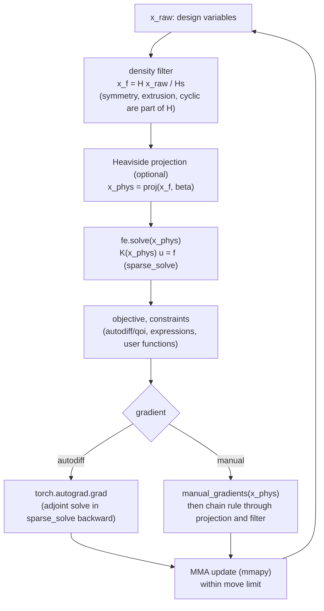

# Architecture

This page maps PyTO's source code: what each package does, how one optimization step flows through them, and which file to open for which kind of change. Read it before any of the "Add a ..." recipes.

All code is in `src/pyto/`.

## Packages
| Package | Responsibility | Main files |
|---|---|---|
| `core` | Geometry and problem data: voxel meshes, boundary conditions, materials | `hex_mesher.py` (`HexMesher`), `bc.py` (`BC`, rigid-body check), `mat_lib.py` (materials), `tet_mesher.py` (tet meshes for export) |
| `physics` | FE solvers: assemble and solve for a density | `structural/hex_structural_fea.py`, `thermal/hex_thermal_fea.py`, `thermoelastic/thermostructural_fea.py`, `hex_element_stiffness.py` (element matrices) |
| `solve` | Linear solvers and the shared `Solvers` enum | `solvers.py`, `numpy_backend.py` (analysis path), `deflation.py` |
| `autodiff` | Everything differentiable | `sparse_solve.py` (solve with an adjoint backward pass), `material_model.py` (SIMP/RAMP laws), `qoi/` (quantities), `reference_adjoint/` (derived sensitivities) |
| `autodiff/qoi` | Quantities of interest | `responses.py` (the response registry used by expressions and the GUI), `__init__.py` (dispatch by `TO_QOI` type), `compliance.py`, `stress.py`, `mass.py`, `volume_fraction.py`, `gvector.py`, `user_function.py` |
| `topopt` | Optimization: formulation, filters, methods | `common.py` (`TOParams`, `TO_QOI`, `TO_METHODS`, `createFilters`), `spec.py` (`OptimizationSpec`, `compile_spec`), `expressions.py` (formula compiler), `filters.py`, `capabilities.py` (method support, gradient check, cost), `manual_sensitivities.py` |
| `topopt/drivers` | Optimization methods | `mma.py` (+ `mmaWrapper.py` around the `mmapy` package), `oc.py`, `pareto.py`, `levelset.py`, `_shared.py` (set-up every driver needs) |
| `io` | Files | `stl_reader.py`, `topopt_stl_recovery.py` (voxel result → smooth STL), `solidworks_interface.py` |
| `gui` | The desktop application | `PyTOGUI.py` (windows), `optimization_setup.py` (formulation panel and its logic, no Qt needed for the logic), `hex_plotter.py` (PyVista plotting) |
| `examples_benchmarks` | Ready-made problems and the sweep runner | `hex_*_examples.py` (geometry, loads), `topopt_*_benchmarks.py` (problem enums, `TOParams` per problem), `topopt_run_benchmarks.py` (`build_benchmark`, sweeps) |

**Import direction:** `core` ← `physics` ← `autodiff` ← `topopt` ← `gui` / `examples_benchmarks`. Lower layers never import higher ones, with one exception: `physics_of()` in `autodiff/qoi/responses.py` imports the solver classes lazily to name the physics. Keep it that way: a new solver shouldn't need to know about optimizers.

## One MMA iteration

The code for this is `obj_cons_function` / `chain` and `manual_step` in `topopt/drivers/mma.py`.

## Where to make a change
| I want to ... | Start here | Recipe |
|---|---|---|
| optimize a new quantity (usable in formulas and the GUI) | `autodiff/qoi/responses.py` | [Add a response](add-a-response.md) |
| a faster or reference gradient for a quantity | `topopt/manual_sensitivities.py`, `autodiff/reference_adjoint/` | [Add a manual sensitivity](add-a-manual-sensitivity.md) |
| a new filter, projection or manufacturing constraint | `topopt/filters.py`, `topopt/common.py`, `drivers/mma.py` | [Add a filter](add-a-filter.md) |
| a new PDE or element type | `physics/` | [Add a physics](add-a-physics.md) |
| a new optimization algorithm | `topopt/drivers/` | [Add an optimization method](add-an-optimization-method.md) |
| a new density-to-property law | `autodiff/material_model.py` | [Add a material model](add-a-material-model.md) |
| neural networks in the loop | a new driver or a reparameterization | [Machine-learning approaches](ml-approaches.md) |
| a new benchmark problem | `examples_benchmarks/` | [Benchmarks from code](../code/benchmarks-from-code.md#adding-a-benchmark-problem) |

## Conventions
- **Units:** SI everywhere inside the library. Only the GUI converts to display units.
- **Precision:** float64 for everything numerical (`torch.float64`). Mixed precision breaks the gradient checks.
- **Torch vs NumPy:** anything on the path from `x` to an objective must be torch, or the gradient is lost. Set-up data (meshes, BC arrays, filters) is NumPy/SciPy.
- **Tests:** every numerical addition comes with a test comparing it with an independent value, e.g. finite differences or autograd. See [Testing your extension](testing-your-extension.md).
- **Unsupported source files:** `hex_largeDeformationFEA.py`, `hex_modal_fea.py`, `tet_structural_fea.py`, `tet_thermal_fea.py` and the transient thermal files are unfinished and not part of the supported feature set.

---
Next: [Add a response](add-a-response.md) · [Back to contents](../README.md)
