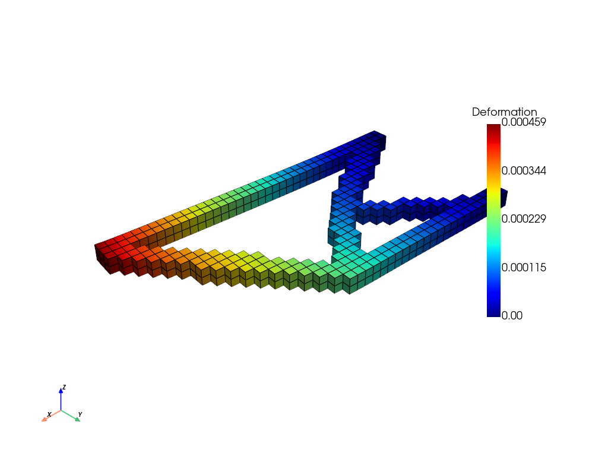
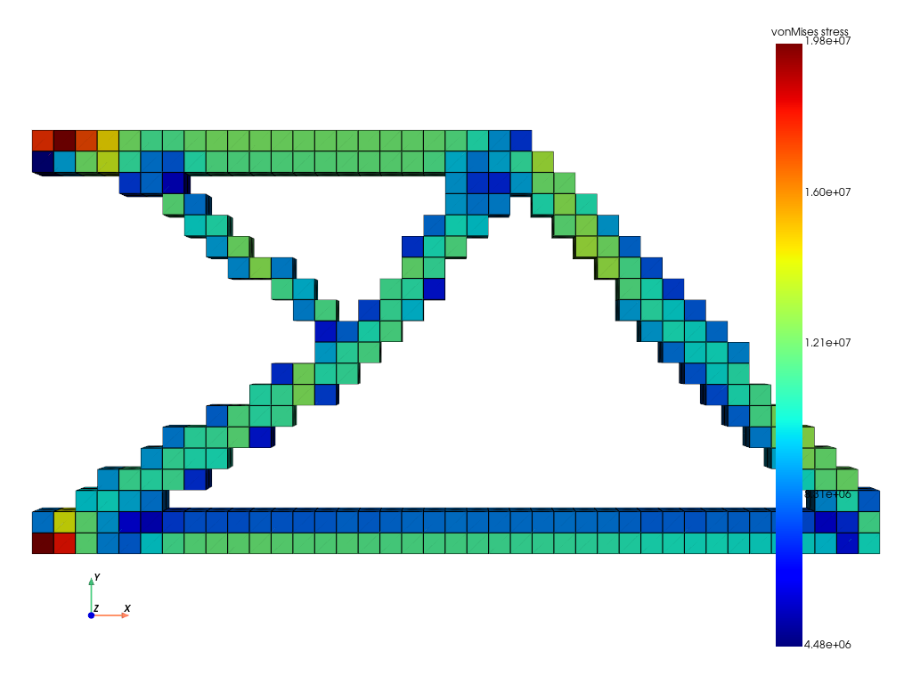
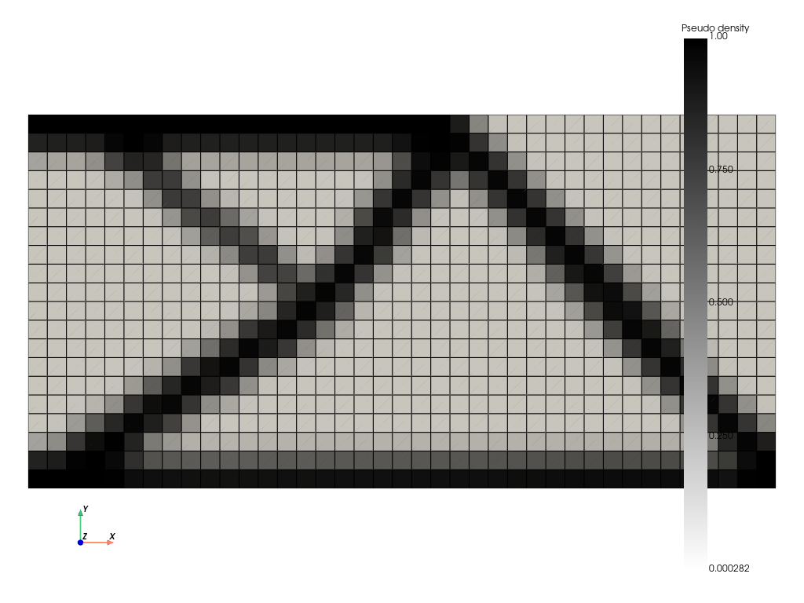

# Fields and plots

This page shows how to get and draw the fields of a result: density, deformation, stresses, strains and temperature. It is for anyone making figures or checking a design's behaviour.

## Where the data is
After an optimization, the solver holds the last solve. That is the delivered design for MMA, OC, Pareto and LevelSet.

| Data | Where | Shape |
|---|---|---|
| density | `fe.mesh.elemPseudoDensity` | (elements,) |
| displacement | `u` (driver return), `fe.sol` | (3 × nodes,) |
| displacement magnitude | `fe.deformation` (torch) | (nodes,) |
| temperature | `fe.sol` (thermal), `fe.temperature` (thermo-structural) | (nodes,) |
| strain, stress, von Mises, strain energy | after `fe.postprocess()`: `fe.strainComponents`, `fe.stressComponents`, `fe.vonMisesStress`, `fe.elemStrainEnergy` | (elements, 6), (elements, 6), (elements,), (elements,) |

- **Components:** strains and stresses are evaluated at the element centre, in the order xx, yy, zz, followed by the three shear components.
- **Relaxed stress:** `vonMisesStress` (and `elemStrainEnergy`) use the relaxed stress, $(\varepsilon_v + (1-\varepsilon_v)x^{0.5})\,\sigma$, the same as the stress constraints, so void elements show no artificial stress. `stressComponents` is the unrelaxed stress.
- **Thermo-structural solvers:** stresses come from the elastic strain (total minus thermal).

To analyse a design other than the last one, solve it first: `fe.solve(torch.as_tensor(x))`, then `fe.postprocess()`.

## Pictures
Each method writes a PNG if `save_path` is given; otherwise it opens a window. For scripts and servers, set `pyvista.OFF_SCREEN = True` first.
```python
fe.postprocess()
fe.plot_mesh(save_path="design.png", plot_bc=None, title=None, camera_position="xy")   # solid elements (> 0.5)
fe.plot_pseudo_density(save_path="density.png")                                        # all elements, grey scale
fe.plot_deformation(save_path="deformation.png")                                       # deformed shape, colour = |u|
fe.plot_vonMisesStress(save_path="vonmises.png")
fe.plot_stress_component(stressComponent=0, save_path="sxx.png")                       # 0..5
fe.plot_strain_component(strainComponent=1, save_path="eyy.png")
fe.plot_elem_field(my_values, title="my field", save_path="field.png", colormap="viridis")   # any per-element array
# thermal solvers (or fe.thermal_fea of a thermo-structural one):
fe.plot_temperature(save_path="temperature.png", annotate_max_min=True)
```
| Argument | Meaning |
|---|---|
| `camera_position` | `"xy"` (view along z, for 2.5D problems), `"iso"`, or a PyVista camera tuple (`plot_mesh`) |
| `plot_bc` | draw supports and loads (`plot_mesh`) |
| `mask_low_pseudodensity` | `plot_elem_field`: hide elements with density ≤ 0.1 (default `True`) |
| `plotter` | draw into an existing PyVista plotter (the GUI does this) |

Examples from the cantilever post-processing run:

| Deformation | von Mises stress | Density |
|---|---|---|
|  |  |  |

## Numbers on the solid part only
Grey and void elements distort maxima (a nearly void element can carry an odd stress). `final_design_summary` reports on elements with density > 0.5:
```python
from pyto.gui.optimization_setup import final_design_summary

summary = final_design_summary(fe, "structural")           # or "thermal", "thermo-structural"
for line in summary["lines"]:
    print(line)
# Final design: 31.9 % of the elements are solid (density > 0.5).
# Max displacement (solid region): 0.0004587 m
# Max von Mises stress (solid region): 1.981e+07 Pa = 0.08 x yield strength
```
The dict also holds `max_displacement`, `max_von_mises`, `yield_ratio`, `max_temperature`, and the element temperatures.

## In the GUI
**Analysis → Show results** draws deformation, stress or temperature for the initial design (after an analysis) or the optimized one (after an optimization). See [Analysis](../gui/analysis.md).

---
Next: [Thresholding and evaluation](thresholding-and-evaluation.md) · [Back to contents](../README.md)
