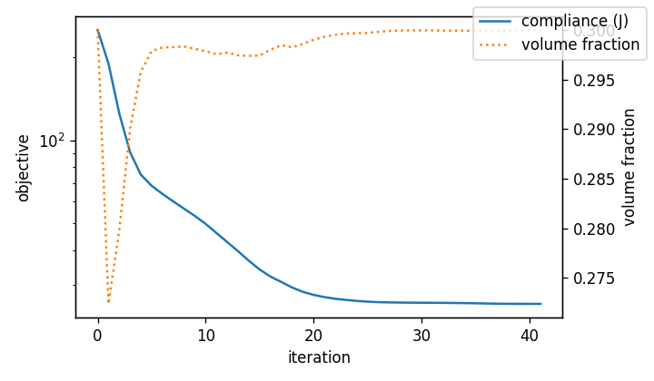

# History and convergence

This page explains what an optimizer returns about its progress, how to plot it, and how to tell whether a run converged and met its constraints. It is for anyone judging an optimization result.

The complete post-processing example used in this part is [`docs/examples/postprocess.py`](../examples/postprocess.py).

## The history dict
Every driver returns `history`: a dict of lists with one entry per iteration.

| Key | Content |
|---|---|
| `objective` | the objective value in physical units (J, m, Pa, ...). For `maximize f` it holds the minimized −f; the GUI shows +f |
| `volfrac` | mean physical density |
| `constraint_1`, `constraint_2`, ... | MMA: each constraint in its normalized form, **≤ 0 means satisfied** |
| `change` | OC: the largest density change per iteration |

For MMA, the **last entry** is the delivered design, evaluated once more after optional binarization. The entry before it is the last continuous iterate. See [Running the optimizers](../code/running-optimizers.md#mma).

## From normalized constraints to real values
Constraints are stored in the form MMA works with; see [Formulations with specs](../code/formulation-with-spec.md#compile).

| You wrote | Stored `g` | Real value from `g` |
|---|---|---|
| `f <= b` (b > 0) | `f/b − 1` | `f = (g + 1) · b` |
| `f <= b` (b ≤ 0) | `f − b` | `f = g + b` |
| `f >= b` | `1 − f/b` | `f = (1 − g) · b` |

```python
b = 0.45
left_half = (history["constraint_2"][-1] + 1.0) * b        # a "<= 0.45" constraint
```
When the formulation came from a spec, `to_params.ConstraintLabels` holds `(expression, op, bound)` for each constraint.

## Plot convergence
```python
import matplotlib.pyplot as plt

fig, ax = plt.subplots(figsize=(6, 3.5))
ax.plot(history["objective"], label="compliance (J)")
ax.set_xlabel("iteration"); ax.set_ylabel("objective"); ax.set_yscale("log")
ax2 = ax.twinx(); ax2.plot(history["volfrac"], "C1:", label="volume fraction"); ax2.set_ylabel("volume fraction")
fig.legend(loc="upper right"); fig.tight_layout(); fig.savefig("convergence.png", dpi=120)
```


A typical MMA run looks like this: a fast drop in the first 10–20 iterations, then slow refinement. The volume constraint becomes active (0.300) early.

## Did it work?
- **Converged:** the objective curve is flat at the end. If it is still falling at the iteration limit, run longer.
- **Constraints met:** every `constraint_i` is ≤ 0 at the end (a few 1e-4 is tolerance). The iteration printout says `ok` or `violated` per constraint, in the terminal or the GUI's **Iterations** tab.
- **Oscillation:** alternating values mean the move limit is too large for this problem, or a design-dependent load. Lower `move_limit` (MMA) or `move` (OC).
- **Jumps with Heaviside projection:** the objective jumps every time β doubles (every `HeavisideBetaInterval` iterations). That is expected.
- **Last value much worse than the one before:** the final 0/1 thresholding cut thin members. See [Thresholding and evaluation](thresholding-and-evaluation.md).
- **`message`:** `"No errors."`, or for example a warning that a stress limit is exceeded by the final design.

## Watching live
- **GUI:** the live plot and the **Iterations** tab in TopOpt Execute.
- **Code:** pass `iteration_callback=fn`; `fn(history)` is called after each iteration (MMA, OC). See [Running the optimizers](../code/running-optimizers.md#callbacks-live-monitoring).

---
Next: [Fields and plots](fields-and-plots.md) · [Back to contents](../README.md)
