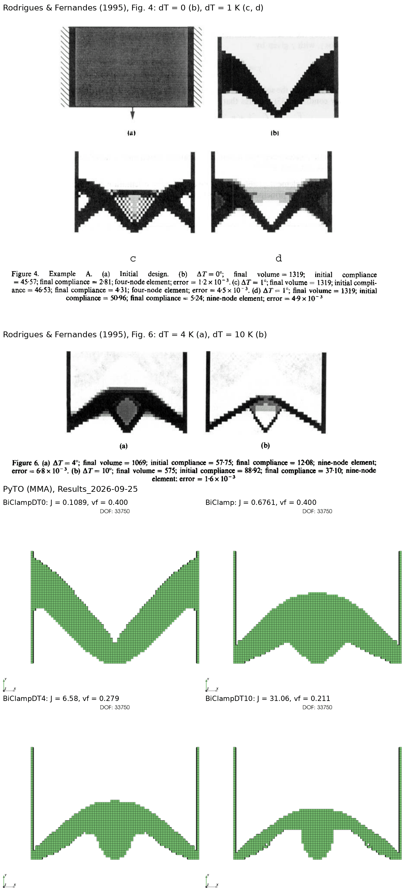
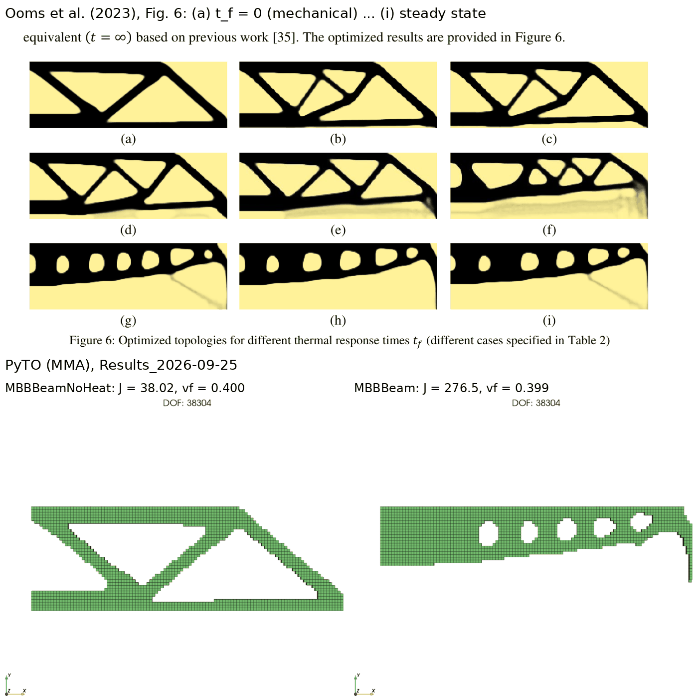

# Validation

This page collects the evidence that PyTO's results and gradients are correct: comparison with published results, the benchmark sweep against a saved reference, gradient accuracy, and measured cost. It is for anyone deciding how far to trust PyTO, or citing it.

## Published thermo-structural results
**BiClamp** (Rodrigues & Fernandes 1995, Example A): a 72 × 47.7 cm plate clamped on both sides, loaded at the bottom centre, with 40 % material, under a uniform temperature rise ΔT = 0, 1, 4 and 10 K. PyTO's designs follow the paper's trend: as ΔT grows, the design moves away from the stiff arch, because clamped material that expands pushes against the supports.

**MBB beam** (Ooms et al. 2023): half MBB beam, with Heaviside projection and the paper's conductivity law. The purely mechanical case matches the paper's compliance within **0.8 %**; the heated case reproduces the design trend.

The images are made by `make_publication_comparison` ([Comparing results](../postprocessing/comparing-results.md#comparing-with-published-results)).

## Benchmark sweep against the reference
The full sweep (all problems × MMA, OC, Pareto, LevelSet) was compared with a reference sweep made by an earlier version of the code, with a hand-derived-gradient MMA. Sweep of 2026-09-25:

| Method | Better | Same (±1 %) | Reference better | Not comparable | New (no reference) |
|---|---|---|---|---|---|
| MMA (autograd) | 14 | 10 | 3 | 3 | 5 |
| OC (autograd) | 0 | 20 | 0 | 0 | 7 |
| Pareto | 0 | 19 | 1 | 0 | 1 |
| LevelSet | 0 | 19 | 0 | 0 | 1 |

**Of 89 problem/method pairs that succeeded in both sweeps, 82 matched or beat the reference.** The rest:
- **Reference better by 1–6 %:**
  - LBracketTopLoad_Vol_Stress (+6.0 %);
  - TwoBar (+2.2 %);
  - Multiload, Pareto (+1.1 %);
  - CantileverMidLoadVolumeCompliance (+1.0 %).
- **Stopped at the iteration limit:** the four stress problems with MMA reached 150 iterations, where the reference stopped after 65–88. Three of the four still ended with better objectives.
- **Not comparable:** the thermo-structural problems were redefined to match the papers (above), and one stress problem ended at a different volume fraction.
- **OC on thermo-structural problems:** it oscillates and doesn't converge. OC is therefore disabled for them in the GUI and in `method_support`.

**Known open item:** the prescribed-temperature thermal problems (FourCornersThermal, BridgeThermal) differ from the reference. The reference predates a fix to the thermal compliance sign, and the comparison is still being reviewed.

## Gradient accuracy
| Check | Result |
|---|---|
| Linear-solve adjoint (`torch.autograd.gradcheck` on `SparseLinearSolve`) | passes |
| Every built-in response vs central finite differences (`tests/test_responses.py`, `tests/test_qoi_gradients.py`) | within 1e-4 relative |
| Manual vs autograd gradients (`tests/test_manual_sensitivities.py`) | compliance 9e-15, p-norm stress 1.7e-14, thermo-structural compliance < 1e-6 |
| Full MMA and OC runs, manual vs autograd | identical iterates |
| User functions and expressions vs finite differences (`check_gradient`) | typically 1e-7 to 1e-10 |

## Cost of the gradient
Measured with `tests/test_gradient_cost.py`: 25 000 requested dofs, 10 repeats, PARDISO, with the forward factorization reused in the adjoint. Seconds per evaluation:

| Case | Problem | dofs | Forward | Backward | Forward + backward |
|---|---|---|---|---|---|
| Structural compliance | MBBBeam | 38 304 | 0.600 | 0.260 | 0.860 |
| Structural p-norm stress | LBracketTopLoad_Stress_Vol | 38 961 | 0.616 | 0.265 | 0.881 |
| Thermal compliance | HeatPlate | 9 245 | 0.068 | 0.028 | 0.096 |
| Thermo-structural compliance | BiClamp | 33 750 | 0.577 | 0.208 | 0.786 |

- The backward pass costs about 0.4× the forward.
- The adjoint solve itself is small (about 33 ms at 38k dofs with stored factors). Most of the backward time is autograd through the stiffness assembly.
- Every additional solution-dependent constraint adds about 0.26 s per iteration at this size.

## Test suite
About 230 automated tests (`tests/`), run before every change: gradient checks, driver runs, formulation compilation, GUI logic, and headless GUI windows. See [Testing](testing.md).

---
Next: [Troubleshooting](troubleshooting.md) · [Back to contents](../README.md)
